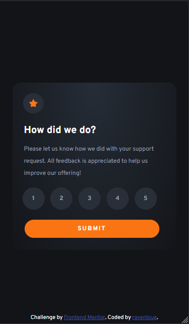

# InteractiveRatingComponent
 A small project that handles user interactions and updating the DOM with JavaScript from Frontend Mentor

This is my solution to the [Interactive rating component challenge on Frontend Mentor](https://www.frontendmentor.io/challenges/interactive-rating-component-koxpeBUmI). Frontend Mentor challenges help you improve your coding skills by building realistic projects. 

## Table of contents

- [Overview](#overview)
  - [The challenge](#the-challenge)
  - [Screenshot](#screenshot)
  - [Links](#links)
- [My process](#my-process)
  - [Built with](#built-with)
  - [What I learned](#what-i-learned)
  - [Continued development](#continued-development)
  - [Useful resources](#useful-resources)
- [Author](#author)

## Overview

### The challenge

Users should be able to:

- View the optimal layout for the app depending on their device's screen size
- See hover states for all interactive elements on the page
- Select and submit a number rating
- See the "Thank you" card state after submitting a rating

### Screenshot

### Links

- Solution URL: [x](https://www.frontendmentor.io/solutions/interactive-rating-component-JQDB_XbYCT)
- Live Site URL: [x](https://ravenloue.github.io/InteractiveRatingComponent/)

## My process

### Built with

- Semantic HTML5 markup
- CSS custom properties
- Mobile-first workflow
- JavaScript

### What I learned

Thanks to my recent practice with JavaScript event listeners; the scripting portion of the assignment took very little time. My CSS skills are a bit rusty; however, and I spent far too long trying to get the circular elements the correct shape.

- 2023, January 23
    - Completed the project after about 4.5 hours.

### Continued development

Since I spent way too long with CSS, I'm going to continue with the Frontend Mentor challenges. This will allow me to become better with JavaScript while maintaining my understanding of CSS. 

### Useful resources

- [RGB to HSL](https://www.rapidtables.com/convert/color/rgb-to-hsl.html) - I found this super helpful for determining equivalents when trying to add a few extra colors 
- [W3Schools CSS Reference Sheet](https://www.w3schools.com/cssref/) - Very handy resource! I'm going to continue with this one

## Author

- Website - [GitHub/ravenloue](https://github.com/ravenloue)
- Frontend Mentor - [@ravenloue](https://www.frontendmentor.io/profile/ravenloue)
- Twitter - [@ravenloue](https://www.twitter.com/ravenloue)
- LinkedIn - [Brandie Mallard](https://www.linkedin.com/in/brandie-mallard-0554aa219/)